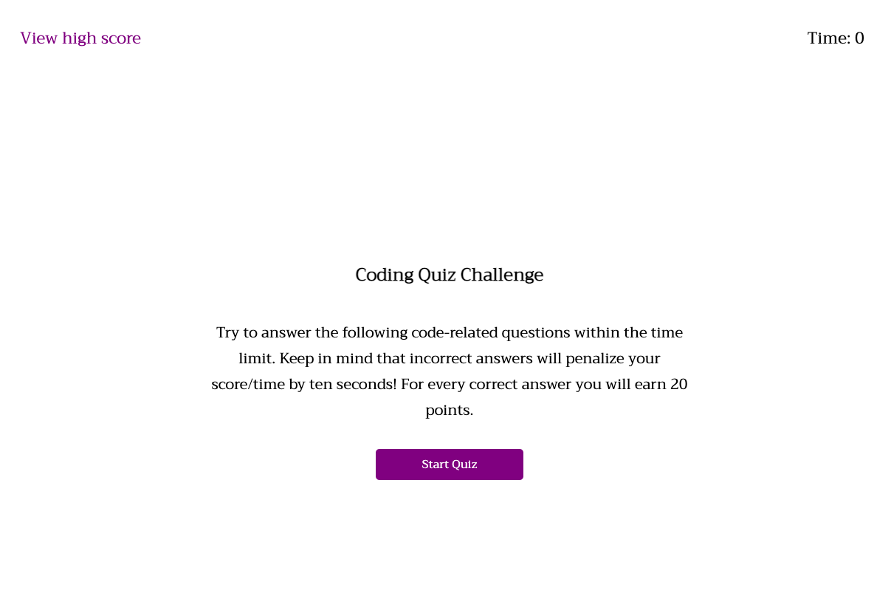

# Web API Code Quiz

## Description

This week we built a timed coding quize with mutliple-choice questions. This app runs in the browser which allows user to take part in answering 5 questions within a time frame. For each incorrect answer, the time will be subtracted from the clock, for each correct answer a score of 20 will be calculated. When all the questions are answered or when the timer reaches 0, then the quiz will end allowing the user to input their initials and view their final quiz score. They may try the quiz again by clicking the back button, or view their highscore on the top left corner. If they would like to clear their previous score, they may clear it using the clear high score button.

## Usage

To get familiar with completing coding assessment as well as to familiarize with user with week 4 Module.

## Link to site

[Lavanya's Module 4 Challenge link](https://lavanyavirushan.github.io/m4c-code-quiz/)

## GitHub link

[Lavanya's GitHub Repository] (https://github.com/lavanyavirushan/m4c-code-quiz)

## Screenshot of the site

## License

Please refer to the LICENSE in the repo.
